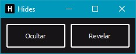
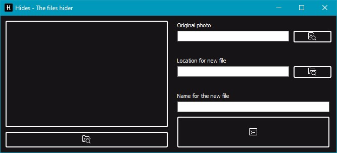
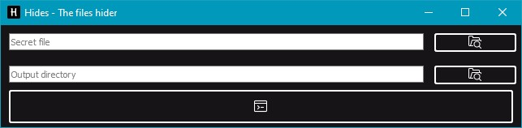

# Hides
> The files hider.

[](https://github.com/pre-commit/pre-commit)

With Hides you can hide your important files from the eyes of everyone
by embeding them into an image in a way that you can still open the image
like any other, but still being able to reveal said files.



## Installation

Windows:

```
python main.py
```
or
```
main.py
```

OS X & Linux:

still a work in progress

## Usage example

### Hide


For hiding files, choose the Hide method on the menu, then
choose what directory you want to hide, choose the image you want to use as disguise,
choose where you want the output to go, and finally choose a name for your new image with
the hiden files.

### Reveal


For revealing files, choose the Reveal method on the menu, then
choose what picture you want to reveal, and choose where the output will go.

## Author(s)

Hector Espinoza – hector_espinoza02@hotmail.com


### License

Distributed under the GNU AGPLv3 license. See ``LICENSE`` for more information.


### Icons
[StreamLineIcons](https://app.streamlineicons.com/home)
