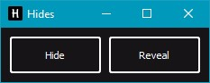

# Hides
> El ocultador de archivos.

Con Hides puedes ocultar tus archivos importantes a los ojos de todos
incrustándolos en una imagen de una manera que todavía puede abrir la imagen
como cualquier otro, pero aún siendo capaz de revelar dichos archivos.



## Instalación

Windows:

```
python main.py
```
o
```
main.py
```

OS X & Linux:

Sigue en progreso

## Uso

### Ocultar / Encriptar
Para el cifrado de archivos / Ocultar archivos, elige el método de cifrado en el menú, luego
elige qué directorio quieres ocultar, elige la imagen que quieres usar como disfraz,
elige dónde quieres guardar el output y finalmente elige un nombre para tu nueva imagen con
los archivos escondidos.

### Revelar / Descifrar
Para descifrar archivos / Revelar archivos, elija el método de descifrado en el menú, luego
elija qué imagen desea revelar y elija a dónde irá el output.

## Autor(es)

Hector Espinoza – hector_espinoza02@hotmail.com


### Licensia
Distribuido bajo la licensia GNU AGPLv3 license. Mira ``LICENSE`` para mas información.


### Iconos
[StreamLineIcons](https://app.streamlineicons.com/home)
